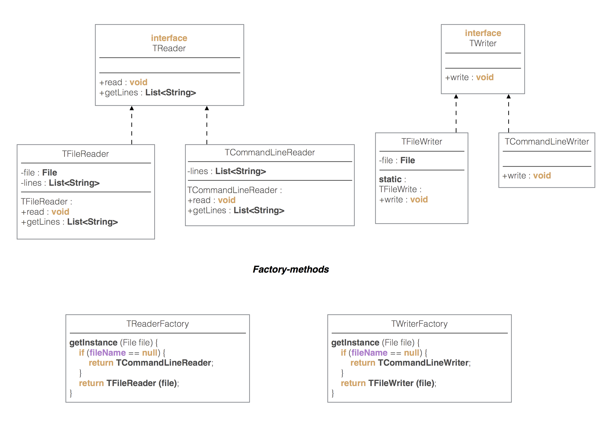

= Задание 2

=== Вариант 11. transpose ===

"Транспонирует" входной текст по входящим в него словам, разделенным последовательностями
пробелов, т.е. если входящий файл содержал строки "A  B C" и "D E", то результатом
будет файл со строками "A D", "B E" и "C".

*   *file* задает имя входного файла. Если параметр отсутсвует, следует считывать текст с консоли.
*   Флаг __-o__ *ofile* задает имя выходного файла. Если параметр отсутсвует, следует выводить результат на консоль.
*   Флаг __-a__ *num* означает, что в выходном тексте каждое слово должно занимать num символов, а оставшееся
    место (если оно есть) должно быть заполнено пробелами.
*   Флаг __-t__ означает, что если слово "не влезает" в выделенное для него место (флагом __-a__), то его
    следует обрезать до нужного размера.
*   Флаг __-r__ означает, что слово в рамках выделенного для него места (флагом __-a__) следует
    выравнивать по правой границе. Если данный флаг не указан, слово выравнивается по левой границе.

Command line: transpose [-a num] [-t] [-r] [-o ofile] [file]

В случае, когда какое-нибудь из имен файлов указано неверно, следует выдать ошибку. В случае, если флаг __-a__
отсутсвует, но присутствуют флаги __-t__ или __-r__, следует выравнивать текст так, будто указан флаг "__-a__ 10".

Кроме самой программы, следует написать автоматические тесты к ней.

___

=== UML - диаграмма некоторых классов и интерфесов

